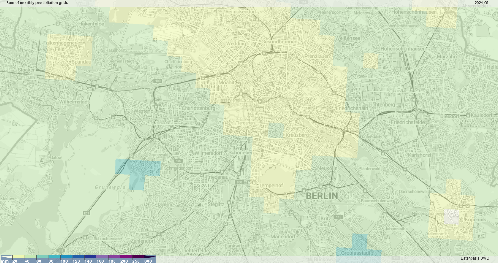
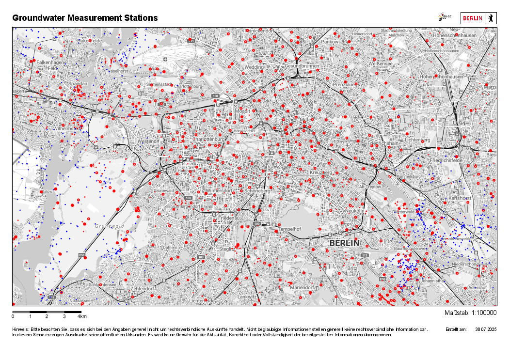

# Berlin Basement Flooding Alert System
**Team: **


The objective of this project is to build a system that analyzes weather and
groundwater time series in Berlin to flag potential basement flooding risks.
Users receive alerts to take preemptive action (e.g. remove valuables or
equipment from basements).

The first dataset provides daily precipitation levels on a 1km grid. Hourly
precipitation levels at 5 weather stations in Berlin are also available.
The second dataset provides daily groundwater measurements at 892 stations in
Berlin.

This project is part of a [DataScientest](https://datascientest.com/) Machine Learning Engineering training.

## Specific aspects of the project
- continuous ingestion of new data via APIs
- creating a model to predict from time series data for multiple user
locations
- deploying a deep learning model in production
Resources to refer to:
## Data
[DWD Precipitation Data](https://www.dwd.de/EN/ourservices/cdc/cdc.html?nn=495490&lsbId=646268)

*Figure: DWD RADOLAN precipitation grid coverage showing Berlin metropolitan area.*

[Berlin Groundwater Measurements](https://daten.berlin.de/datensaetze/wasserportal-berlin)

*Figure: Distribution of groundwater monitoring stations across Berlin.*


## Technical Approach

- apply unsupervised time series models (e.g. Isolation Forest, Autoencoders, or LSTM-based forecasting with residual anomaly scoring)
- combine multiple signals (precipitation, water level trends, seasonality) to detect local anomalies
- possibly incorporate geospatial data (elevation, building proximity to waterways) to personalize risk detection

##  Roadmap

### Phase One
- Data ingestion:
    - get the necessary data from Wasserportal Berlin and DWD
    - build a data ingestion pipeline
- Data Inspection: 
    - explore correlation of the temporal data
    - visualize time series, 
    - inspect for noise and missing data
    - explore link between groundwater level and precipitation
### Phase Two
- train a first model
- train a deep learning model with GPUs
### Phase Three
- scaling, containerization
- automized experiment tracking
- deployment

# Bibliography
- [Berlin Wasserportal API](https://wasserportal.berlin.de/download/wasserportal_berlin_getting_data.pdf)
- [DWD Data set description](https://opendata.dwd.de/climate_environment/CDC/grids_germany/daily/radolan/recent/bin/DESCRIPTION_gridsgermany-daily-radolan-recent-bin_en.pdf)
- [Radolan Data Standard](https://www.dwd.de/DE/leistungen/radolan/radolan.html)
- [Wradlib references](https://docs.wradlib.org/en/2.0.0/generated/wradlib.georef.rect.get_radolan_grid.html)


# Legal Disclaimer

**IMPORTANT: This is an educational project only.**

This repository documents a machine learning project developed as part of a DataScientest training program. It is **NOT** intended to provide a functional flood warning system or emergency alert service. It has not undergone the rigorous testing, validation, and certification required for critical infrastructure applications.

**For actual flood warnings and emergency information, please consult official sources such as:**
- German Weather Service (DWD)
- Berlin Senate Department for the Environment, Mobility, Consumer and Climate Protection
- Local emergency services


# Installation
conda create -n mlops python=3.11 pip  
conda activate mlops

# Packages necessary for the Development environment
pip install -r ./requirements_dev.txt

# Packages necessary for Project functions, BE API and Jupyter notebooks
pip install -r ./requirements.txt

# DOCKER (Python 3.11)
docker-compose up --build

Your Streamlit frontend will be accessible at `http://localhost:8501`, 
and the FastAPI backend will be at `http://localhost:8000`. 
The Streamlit app is configured to use the internal Docker service name `backend` to communicate with the FastAPI API, ensuring smooth communication within the Docker network.

FastAPI docs: http://localhost:8000/redoc  
ML Flow: http://localhost:5000/  
Grafana: http://localhost:3000/ (UN: admin, PW: admin)  
Prometheus: http://localhost:9090/  

AWS/SkySQL is used as a Cloud resource for MySQL compatible MariaDB (Credentials to be added in .env)

## Docker CLI and run Cron Jobs manually
```
docker exec -it fastapi-mlfow /bin/bash

/bin/bash /usr/local/bin/cronjob.sh
```
